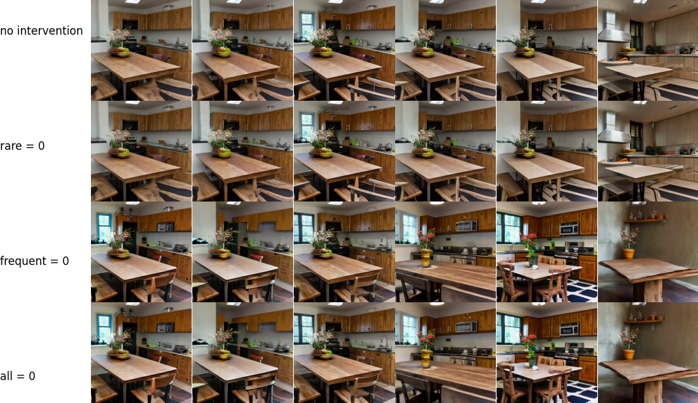

# Interpreting Deep Visual Models with Sparse Autoencoders

This code allows you to reproduce all the results described in the final report, namely: train autoencoders on each Stable Diffusion block, calculate the activation frequencies of each hidden neuron and analyze their activations on various prompts.



# Scripts usage

The code was tested with python 3.12 

## Training Sparse Autoencoders

This script trains a sparse autoencoder for nine stable diffusion blocks. All settings for the train process is specified in the config in `cfg.py`. During the training process, autoencoders, plots of neuron frequencies and their similarities save in the `cfg["save_dir"]` every `cfg["iters_to_save"]` iterations.

### Usage
``` bash
python train.py
```

## Counting frequencies of hidden neurons for different prompts
This script is counting frequencies for different prompts of hidden neurons for each autoencoder and stores these frequencies as numpy arrays, which can be used in the analysis later. It uses ControlNet for generating images to get images as similar in content as possible. Specify desired prompts in `prompts.py`.

### Usage
``` bash
python get_freqs_controlnet.py [img_path] [save_subfolder] --ae_version [ae_version] --cycles [cycles]
```

### Arguments
* `img_path` - The controlling image for ControlNet.
* `save_subfolder` - The subfolder in `ae_{ae_number}/` folder where frequencies will be saved.
* `ae_version` - The version of autoencoder. Default is `15`.
* `num_images_per_prompt` - Number of cycles to count frequences per prompt. Default is `300`.

### Example
``` bash
python get_freqs_controlnet.py "./control_images/table_with_edges.png" "ctrl_freqs/"
```

## Generation with intervention
This script generates images after zeroing frequent or rear hidden neurons in each autoencoder separately. Also it generates corresponding images without intervention and with zeroing all neurons.

### Usage
```bash
python interpret_by_intervention.py [prompt] [save_dir] --ae_version [ae_version] --num_images_per_prompt [num_images]
```

### Arguments
* `prompt` - Prompt to be used for stable diffusion model.
* `save_dir` - Directory where images will be saved.
* `ae_version` - The version of autoencoder. Default is `15`.
* `num_images_per_prompt` - Number of generated images. Default is `3`.

### Example
```bash
python interpret_by_intervention.py "a table in a kitchen" "gen_imgs/" --num_images_per_prompt=2
```


## Analyzing neuron frequinces between two different prompts

This script allows to get the numbers of frequent neurons that were activated on one prompt `mult_threshold` times more often than on another and displays them on a histogram with frequencies of all neurons.

### Usage

```bash
python analyze_freqs.py [ae_number] [frequencies_path] [frequencies_to_compare_path] --subfolder [subfolder] --ae_version [ae_version] --mult_threshold [mult_threshold] --plot_savedir [plot_savedir]
```

### Arguments

* `ae_number` - The number of the autoencoder to analyze
* `frequencies_path` - The path of the file with frequencies of the 1st prompt.
* `frequencies_to_compare_path` - The path of the file with frequencies of the 2nd prompt.
* `subfolder` - The subfolder in the `ae_{ae_number}/` folder where `frequencies_path` and `frequencies_to_compare_path` are located.
* `ae_version` - The version of autoencoder. Default is `15`
* `mult_threshold` - Uses to find neurons which have `mult_threshold` times more frequencies with prompt 1 than with prompt 2. Default is `100`
* `plot_savedir` - The path where histogram will be saved.

### Example 
```bash
python analyze_freqs.py 5 freqs_green.npy freqs_table.npy --subfolder="ctrl_freqs/" --plot_savedir="analyzes/freqs_hist.png"
```

# Authors
Viacheslav Surkov  (https://github.com/surkovv) <br />
Danila Zubko (https://github.com/danila0606)
